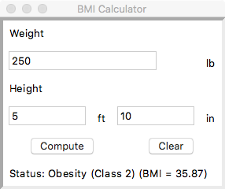

## Lab 6 - BMI Calculator

### Introduction

In this lab you will design and implement a Python-based GUI application that calculates a person's BMI based upon their weight (in lbs), height (feet and inches). With the click of a button, the BMI Calculator will update a Status label with the user's calculated BMI and an assessment based upon their BMI value. A screen snapshot of this application is shown below:



The assessment is based upon the following rules.

| BMI           | Assessment        |
|---------------|-------------------|
| 18.50 or less | Underweight       |
| 18.50-24.99   | Normal weight     |
| 25.00-29.99   | Overweight        |
| 30.00-34.99   | Obesity (Class 1) |
| 35.00-39.99   | Obesity (Class 2) |
| 40 or greater | Morbid Obesity    |

BMI is calculated as follows: Let `w` be your weight (in kilograms) and `h` represent your height in meters.

```text
BMI = w / h^2
```

As your application collects weight and height using imperial units, your BMI calculator must convert the units accordingly. Use the following conversion factors in this regard:

```python
LB_TO_KG_CONVERSION_FACTOR = 0.4535970244
INCHES_TO_METERS_CONVERSION_FACTOR = 0.0254000508
```

For example, if you weigh 250 lbs, this converts to kilograms as follows:

```python
weight_kg = 250 * LB_TO_KG_CONVERSION_FACTOR
```

Similarly, if you are 5' 10", then you are a total of `5 x 12 + 10 = 60 + 10 = 70` inches and in meters this is:

```python
height_m = 70 * INCHES_TO_METERS_CONVERSION_FACTOR
```

### Tasks

1. Review how to use [variable key-value argument lists](https://www.digitalocean.com/community/tutorials/how-to-use-args-and-kwargs-in-python-3) in Python
1. Implement your BMI Calculator (model) class (`BMICalculator`)
1. Commit your changes.
1. Implement your GUI application (connect the model to your view)
1. Commit your changes.
1. Test your application (manually).

### Submission Details

The usual assignment protocol is followed:

1. Accept this assignment using the URL found in the Blackboard assignment which creates your repository in your GitHub account.
1. Clone your repository and create a branch named develop within which to do your work.
1. Implement the code indicated by the # TODO: comments.
1. Minimally make commits after finishing each function; more commits are encouraged but not required.
1. Once all the unit tests pass, push your final commit to GitHub and create a pull request, requesting to merge your develop branch into your master branch.
1. After the pull request is created, copy the URL of the pull request and paste it into a Text Submission on Blackboard. You should make the URL a working hyperlink that opens the pull request in a new browser window. NOTE: The assignment is officially submitted by the act of creating and submitting this Blackboard Text Submission and it is the timestamp of that activity that dictates when your assignment was actually submitted.

### Due Date

Your assignment must be submitted to Blackboard by 17:00 Tuesday 06 March 2018.